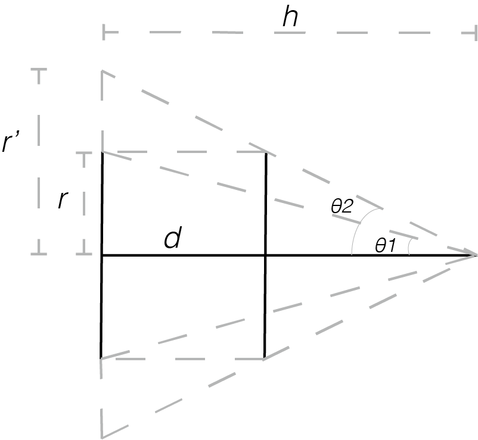

# Motion controled Animation - SensingMachine assignment 1

<!-- vim-markdown-toc GFM -->

* [Demo Videos](#demo-videos)
* [Basic Idea](#basic-idea)
* [Tech detail](#tech-detail)
	* [Drops animation](#drops-animation)
	* [Motion tracking](#motion-tracking)
* [notes](#notes)
	* [Control method](#control-method)
	* [auto correction algorithm with color object tracking](#auto-correction-algorithm-with-color-object-tracking)
	* [depth expression and movements](#depth-expression-and-movements)
		* [perceively visual effect in 3D space](#perceively-visual-effect-in-3d-space)
			* [size scale](#size-scale)
			* [velocity ratio: perceive movements](#velocity-ratio-perceive-movements)
* [logs](#logs)
	* [done:](#done)

<!-- vim-markdown-toc -->

## Demo Videos

<iframe width="560" height="315" src="https://www.youtube.com/embed/0nyqud0FAMk" frameborder="0" allow="accelerometer; autoplay; encrypted-media; gyroscope; picture-in-picture" allowfullscreen></iframe>

>Using color detection

<iframe width="560" height="315" src="https://www.youtube.com/embed/3jMAW00ypwk" frameborder="0" allow="accelerometer; autoplay; encrypted-media; gyroscope; picture-in-picture" allowfullscreen></iframe>

>Using background subtraction

## Basic Idea
- Use motion to control the pattern on screen.

## Tech detail
### Drops animation
- Randomly generated dots on the screen, using class to create object. Make movements according to the motion.
- for dots that are within a certain distance, draw a line between them, transparency according to the distance.

### Motion tracking
- Background subtraction, set learing time to 0 as to find difference between each frame. Change threshold to 
- Object detection:
	- Color object detection: chose a color interval to detect. (similar to SensingMachine class content)

## notes

### Control method
- background subtraction with learning in 2D
- average the whole depth value in 3D

### auto correction algorithm with color object tracking
- increase the threshold value gradually, then recorde the value when there's one blob, as Min.
- increase the threshold value gradually, then recorde the value when there's two blob, as Max.
- use the average of Min and Max as the threshold value

### depth expression and movements

#### perceively visual effect in 3D space
- closer: bigger, more blurry/transparency
- further: smaller, more blurry/transparency

The math is used to achieve the goal of perceively visual effect in 3D place on a 2D screen.

 
>relation between distance and visual scale

##### size scale

We assume that the maximum depth is $h$ (which in my case is $winHeight$); 
the original radius of the drop is $r$; 
the perceively radius of the drop after moving forward is $r'$; 
the coodinate of depth is $d$; 

Then we have the math relationships:  
$tan\theta_{1}=\frac{r}{h}$  
$\frac{r'}{h}=tan\theta_{2}=\frac{r}{h-d}$

Then we have: $r'=\frac{r*h}{h-d}$, which is the transformation formula of what we need.

##### velocity ratio: perceive movements

We need to add a 3D concept - vanish point (*thanks Fanyi pointed out!*) to achive the effect of 3D movements. And the key is to calculate the ratio of speed between real depth speed and perceive 2D speed.

In the previous part we get the ratio of scale, which is $r'=\frac{r*h}{h-d}$. This equation gives the relationship between the depth and perceive radius.

After we do the derivation, we get: $d(radius')=d(depth)*\frac{rh}{(h-depth)^{2}}$. The ratio here is what we need to calculate perceive speed in 2D space.

## logs
- /Users/yongkunli/Desktop/OpenFramework/apps/myApps/myBGsub
	- frame offset tracking, works and committed
- /Users/yongkunli/Desktop/OpenFramework/apps/SensingMachines/SM01_YongkunLI
	- regular rain drops, works and committed.

### done:
- simple control works
- flip the camera
- resize the animation & camera
- rebounce effect
- auto correction
	- make an app to generate colors
	- try autocorrection algrithm
